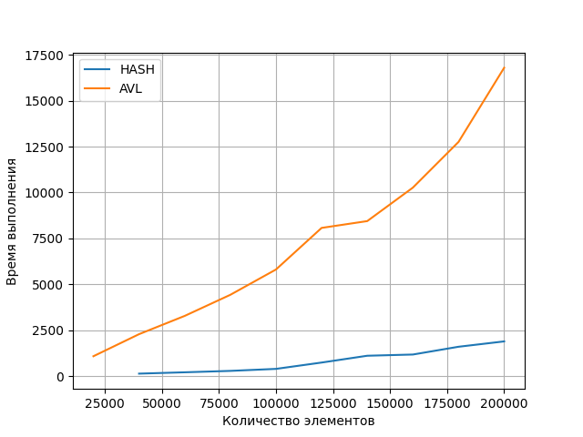

# Сравнение времени выполнения AVL и HASH-TABLE
В обоих классах используется кастомный менеджер памяти, который может вляить на время выполнения. 
Для минимизации указанных негативных эффектов был выбран достаточно большой размер блока менеджера памяти. Так же был выбран большой изначальный рамер хеш-таблицы. 
Тестовый класс заполняется необходимым количеством элементов, затем проводятся тестовые опирации. Количество тестовых операций много меньше количества данных в классе.
